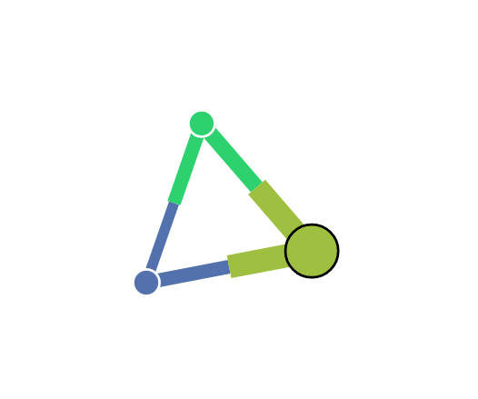

# peer-star-network-vis

[Peer-*](https://github.com/ipfs-shipyard/peer-star-app) collaboration network visualization.

[](https://protocol.ai)



## Example

```js
const PeerStar = require('peer-star-app')
const NetworkVis = require('peer-star-network-vis')

dApp = PeerStar('my app')
await dApp.start()
collaboration = await dApp.collaborate('collaboration name', ...)

// inside my render function
const canvas = document.getElementById('my-canvas')

const vis = NetworkVis(collaboration, canvas)

// later...

vis.stop()
```

## API

A NetworkVis instance emits the following events:

### emit('selected peer', peerId)

When a peer is selected by the user.


### emit('peer stats updated', { peerId, stats })

When the stats for a given peer is updated.

The `stats` object schema is defined in [`peer-star-app`](github.com/ipfs-shipyard/peer-star-app#readme).


## License

MIT
